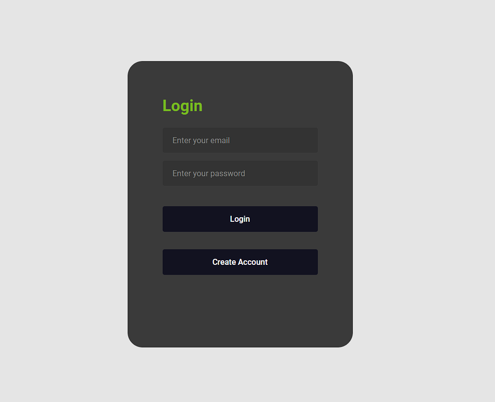

## SPORTCOM

## Members
- **Diego Hidalgo**

## Description
SPORTCOM is a solution for booking management in a sports complex that offers various facilities such as tennis courts, swimming pools, gyms and football pitches. Bookings will be managed by staff. Manual management of these bookings is inefficient and error-prone, especially during peak hours.

## Problem Statement
Manual booking management at the sports complex is inefficient and error-prone, especially at times of high demand. A system that automates the booking process and sends reminders to guests is needed to improve efficiency and reduce errors.

## Features
- **Online Booking:** Users are the ones who will register and have administrative access to the System.
- **Automatic Reminders:** Automatic reminders will be maintained on reservations.
- **Facility Management:** Facilitates facility management and availability.
- **User-friendly interface:** Offers an intuitive interface for users and staff.
- **Security:** Protect user and booking information with authentication and authorization
- **Reports:** Generate audit logs


## Instruction

Follow these steps to get SportCom:

1. **Source code:**
   ```bash
   https://github.com/tu-usuario/SPORTCOM.git

2. **Url: Aplication**
   ```bash
   ------------

3. **Interface**
   ## Login

   
   _App login screen._

   ## Create Users

   
   _Interface to create new users._

   ## Main Interface

   
   -Main view of the application.-
   

